# poddle

The Pebble watch face that brings you back to 2004: a layout in the style of the most popular mp3 player in year 2004
(status bar, info area, progress bar), black on white, in portrait (default)
or landscape.

Targets are every rectangular-screen Pebble:

| Platform | Watches | Screen | Sprites |
|---|---|---|---|
| aplite | Pebble, Pebble Steel | 144×168 B/W | base (16px) |
| basalt | Pebble Time, Time Steel | 144×168 color | base (16px) |
| diorite | Pebble 2, Pebble 2 SE | 144×168 B/W | base (16px) |
| flint | Pebble 2 Duo | 144×168 B/W | base (16px) |
| emery | Pebble Time 2 | 200×228 color | large (22px) |

Round screens (chalk, gabbro) are not supported.

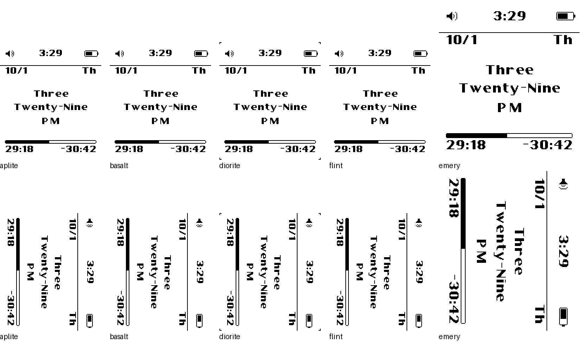

## Development environment

### Normal path

```sh
uv tool install pebble-tool --python 3.13
pebble sdk install latest
pebble build
pebble install --emulator flint
```

### From-source path (when sdk.repebble.com is unreachable)

The cloud container used to build this repo blocks `sdk.repebble.com`, so the
SDK was built from PebbleOS source instead. `tools/setup_sdk_from_source.sh`
reproduces it:

1. Installs host packages (`gettext`, `librsvg2-bin`, cmake/ninja, SDL/pixman
   runtime libs for QEMU).
2. Installs `pebble-tool` with uv (Python 3.13).
3. Installs the [PebbleOS-SDK](https://github.com/coredevices/PebbleOS-SDK)
   release bundle (ARM GCC 14.2 + picolibc + `qemu-pebble`) from GitHub.
4. Clones `coredevices/pebbleos` at a pinned tag (`v4.38.4`), applies
   `tools/pebbleos-qemu-null-event.patch`, builds the `qemu_flint` and
   `qemu_emery` SDK-shell firmware and the app SDK for
   aplite/basalt/diorite/emery/flint.
5. Lays it out as a pebble-tool SDK named `source-local` and activates it,
   adding the official SDK 4.9.77 emulator images for aplite/basalt/diorite
   (legacy firmware 4.3, mirrored in
   [ericmigi/pebble-qemu-wasm](https://github.com/ericmigi/pebble-qemu-wasm)).
6. On hosts without IPv6, patches pypkjs to bind `0.0.0.0` (it otherwise fails
   with `Address family not supported`).

```sh
WORK=~/pebble-src ./tools/setup_sdk_from_source.sh
pebble build
tools/emu.sh start && tools/emu.sh install && tools/emu.sh shot shot.png
EMU_PLATFORM=emery tools/emu.sh start   # also basalt, diorite, aplite
```

Things worth knowing about this path:

- **Frozen platforms.** aplite, basalt and diorite are frozen at old SDK revisions;
  upstream ships their `libpebble.a` prebuilt from the legacy SDK. The script
  regenerates it from the frozen export list. It links and the symbol order
  matches, and the face runs on the legacy 4.3 emulator firmware for all
  three, but it is not byte-identical to the official library. **Build
  release `.pbw`s with the official SDK.**
- **Emulator.** flint and emery boot firmware built from current PebbleOS;
  aplite, basalt and diorite boot the legacy SDK 4.9.77 images. The legacy
  machines draw a 2px frame (cropped by `tools/screenshot.sh`), and diorite's
  also blacks out the corner pixels to mimic the rounded screen. The
  emulators tint white gray, and emery dims it further over time to mimic
  the backlight, so screenshots are binarized.
- **Firmware patch.** The SDK-shell firmware asserts
  (`event_service_client.c:41`) when an installed app launches over the
  built-in TicToc face: the dying app task gets a `PEBBLE_NULL_EVENT`. The
  patch drops null events in the app event loop. It only affects the local
  emulator image.
- **`tools/emu.sh`** runs QEMU headless with pypkjs as the phone. Use it
  instead of `pebble install --emulator`, which reconnects to the
  firmware's serial link, and the firmware stops answering after a
  reconnect.

## The face

Portrait (default) and landscape, switchable in the settings:


Each orientation lays the face out on its own design canvas: the screen in
portrait, the screen turned sideways in landscape (rotated 90° clockwise onto
it). Every glyph and icon comes from one of four sprite sheets, and each sheet
is built twice: upright for portrait, and pre-rotated for landscape. Only the
active orientation's sheets are loaded. Pebble Time 2 gets a larger set of
the same sheets (`NAME~emery.png`, which the SDK packs for emery only), and
`assets.h` and `main.c` pick the matching tables and layout values by display
size. At runtime the face only blits: in
landscape, `canvas_to_screen()` moves a rect's origin onto the screen, and
no pixels are ever rotated.

| Row | Content |
|---|---|
| Status | connection / quiet-time icon · time (follows the 12h/24h setting) · battery |
| Date | `M/D` · two-letter weekday |
| Spoken time | hour word / minute word / AM-PM (always 12-hour) |
| Progress | bar + labels |

The top-left icon shows one of three states: while the phone is
disconnected, a Bluetooth rune with an X (drawn like the quiet-time X);
while connected, the quiet-time speaker, with an X when quiet time is on.
The connection comes from `connection_service` (peeked at start, redrawn on
change). The disconnected icon is in every icon sheet (both orientations,
base and large, and tinted with the white halo in the color theme, where
the rune's small enclosed gaps are filled white too).

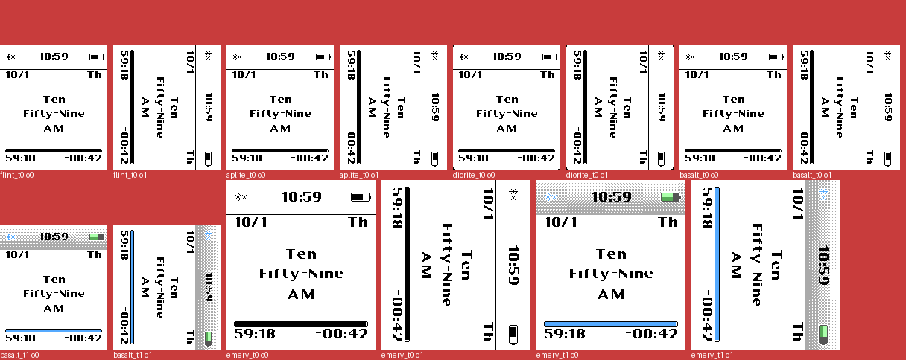

The three states in the color theme on Pebble Time 2: disconnected, quiet
time, sound on:

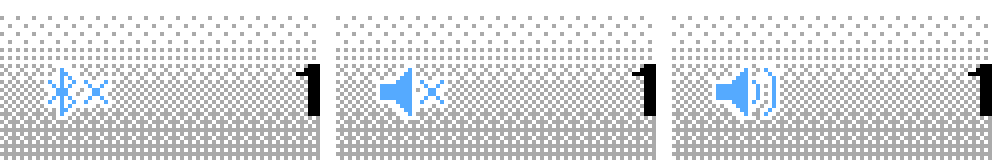

Settings (Clay): orientation (portrait/landscape), theme (color screens
only), what the bar measures (minute/hour), and what the labels show
(start-end/elapsed-remaining).

### Color theme (basalt, emery)

Color screens can switch from black & white to a color theme, modeled on the
color UI of the same player line. The colors are the nearest 64-color palette
values to a reference recreation's title bar (`#feffff` → `#b1b6b9`):

- Status row: white fading to light gray down to the separator row, with
  4×4 ordered dithering between the two (the palette has no grays in
  between). The separator line is hidden.
- Quiet-time icon and progress fill: light blue (`GColorPictonBlue`). The
  The track outline stays black.
- Battery, after the reference battery (`#626262` frame, `#A5E07F` charge
  under a highlight/shade gradient): dark gray frame (`GColorDarkGray`), and
  a charge that fills the whole interior, light green in the upper half
  (`GColorMintGreen`) and darker green in the lower half (`GColorMayGreen`),
  over a dark gray empty part (`GColorDarkGray`, the reference's `#54585b`).
- Both status icons get a 1px white halo on the outside, so their thin
  strokes stay legible on the gray.

The tinted icons are a separate sheet (`icons_color*.png`, packed for
basalt/emery only, every icon padded 1px for the halo) drawn with
`GCompOpSet`. The gradient is rendered once
into a cached 8-bit bitmap. Text stays black.

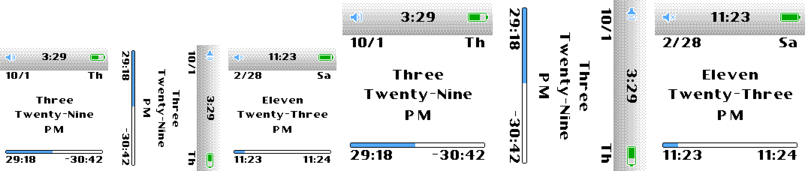

Ticks are per-second when the bar is in minute mode or the labels show
elapsed/remaining, and per-minute otherwise.

### Layout values (for review)

All in canvas pixels for the 144×168 screens. Text y values are cap tops,
and text ink keeps an 8px margin on both sides. W×H is the canvas: 144×168
portrait, 168×144 landscape.

- Status row 0–32: text cap at y=11, centered on W/2; icons at y=12; speaker
  x=8 (the connection / quiet-time icon); battery body from W−24 to W−7 (nub
  2px past it); separator line at
  y=33.
- Date row: cap at y=36.
- Spoken time, centered on W/2: the block (hour cap top to AM/PM baseline,
  48px) is centered between y=50 and the track, 2px high, which gives caps
  at y=69 / 88 / 108 in portrait and 57 / 76 / 96 in landscape.
- Progress: track x=7, y=H−28, (W−14)×5 with clipped corners; labels cap at
  y=H−20.

These come from measuring the mockup at 1× (Frames 1–2 for portrait, Frame 3
for landscape). In both orientations every element sits within 1px of the
mockup (`tools/compare_mock.py`) on flint, and on basalt, diorite and
aplite.

Pebble Time 2 uses the same rules with every value scaled by 22/16 and
rounded (`#if ASSET_LARGE` in `main.c`): 11px margins, separator at y=46,
13px caps, a 7px-tall track.


### Font

[Carthage Sans](https://github.com/csyde/carthage-fonts) Bold by Brian
Connors, used under the SIL Open Font License 1.1 (see `tools/fonts/`). It is
rendered at 16px, where one FontStruct brick is exactly one pixel, which
gives a 9px cap height. The longest line, "Twenty-Three", is 122px wide, so
it and "O'Clock" (61px) fit easily. Pebble Time 2 gets 22px (13px caps,
still 1-bit). Bricks there land on 1 or 2 pixels, so strokes vary by a pixel,
which still reads crisply; "Twenty-Three" is 168px of the 178px available.

## App store listing

The description and screenshots are attached at publish time; the `.pbw`
carries neither.

- `store/description.txt`: the listing description, which holds the contact
  link and the Carthage Sans credit.
- `store/screenshots/`: five screenshots per platform, regenerated with
  `tools/store_screenshots.sh` (it boots each emulator in turn). Files are
  named `PLATFORM_N_STATE.png`; N is the upload order, and N=1 (portrait,
  default settings) leads the listing.
- `tools/publish.sh`: runs `pebble publish --non-interactive` with both,
  portrait first so it leads the listing. The description only applies when
  the store app is first created. To swap the screenshots of an existing app,
  pass `--replace-screenshots`.

### Store screenshots

Every state below comes from the emulator, with the time, battery and settings pinned through `tools/screenshot.sh`.

- **Black & white screens:** (1) portrait with default settings: hour bar, elapsed/remaining labels; (2) landscape; (3) minute bar with start/end labels; (4) O'Clock in 24-hour style with quiet time on (quiet time is left off on aplite, whose firmware has no Quiet Time API); (5) landscape with the longest minute line.
- **Color screens:** (1) portrait; (2) landscape; (3) color theme, portrait; (4) color theme, landscape; (5) color theme with quiet time on and low battery.
- The diorite set reuses the flint captures: the screen and rendering are identical, and this avoids the corner pixels the diorite emulator blacks out.

| Platform | 1 | 2 | 3 | 4 | 5 |
|---|---|---|---|---|---|
| aplite<br>Pebble, Pebble Steel |  |  |  | 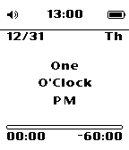 |  |
| diorite<br>Pebble 2, Pebble 2 SE |  |  | 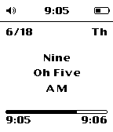 |  |  |
| flint<br>Pebble 2 Duo |  | 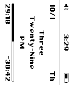 |  | 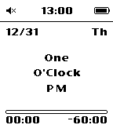 | 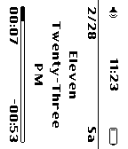 |
| basalt<br>Pebble Time, Time Steel | 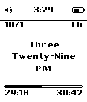 |  | 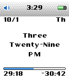 | 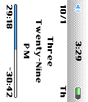 | 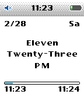 |
| emery<br>Pebble Time 2 |  | 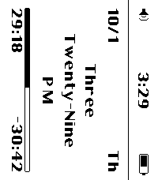 | 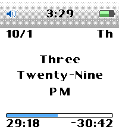 | 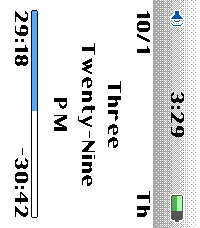 | 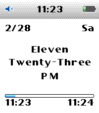 |

## Working on it

```sh
python3 tools/gen_assets.py     # regenerate resources/images/*.png (both orientations) + src/c/assets.h
python3 tests/check_logic.py    # host-side logic tests
pebble build && cp build/poddle.pbw dist/

tools/emu.sh start
# pinned demo build: time date/wday mode format battery quiet 24h orientation theme disconnected
tools/screenshot.sh /tmp/shot 15:29:18 10/1/4 1 1 65 0 0 0 0 0
NODE_PATH=$(npm root -g) node tools/render_mock.js 2026-10-01T15:29:18 /tmp/mock
python3 tools/compare_mock.py /tmp/mock_portrait_hour.png /tmp/shot_canvas.png /tmp/cmp
# landscape: pass 1 as the last screenshot.sh argument, compare with /tmp/mock_canvas.png
```

Screenshot builds pin the time, battery and settings through
`PODDLE_DEFINES` (see `wscript` and the `DEMO_*` blocks in `main.c`). A
normal `pebble build` leaves them out.

## Repository layout

- `src/c/` — watch face (`main.c`), canvas blitting, time words, labels
- `src/c/assets.h`, `resources/images/` — generated sprite sheets (committed)
- `src/pkjs/` — Clay config page
- `tools/` — asset pipeline, SDK setup, emulator/screenshot/compare/publish helpers
- `store/` — app store description and screenshots
- `tests/` — logic tests
- `dist/poddle.pbw` — committed build output
- `docs/` — handover spec, HTML mockup, screenshots
