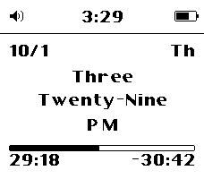
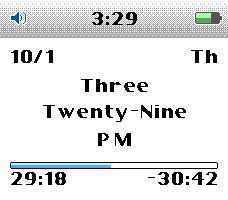
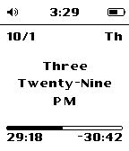

# Poddle

**Get it on the Pebble app store: https://apps.repebble.com/94f77dc0f1a64d2da7c9bc3e**

A Pebble watch face that brings you back to 2004. It takes the layout of the
most popular mp3 player in year 2004 (a status bar, an info area and a
progress bar) and uses it to tell the time.

  
  &nbsp;&nbsp;
  
  &nbsp;&nbsp;
  

## What's on the face

- **Status bar**: the time and the battery level. The icon on the left shows
  whether your phone is disconnected, quiet time is on, or sound is on.
- **Date**: month/day and the day of the week.
- **Spoken time**: the time written out in words, such as "Three /
  Twenty-Nine / PM".
- **Progress bar**: fills up over the current hour or minute, or toward your
  daily step goal, with labels at both ends.

## Settings

Open the watch face's settings in the Pebble app on your phone.

- **Orientation**: portrait (default) or landscape.
- **Theme**: black & white, or color (color watches only).
- **Progress bar**: what the bar measures (current minute, current hour, or
  steps), and what its labels show (segment start / end, or elapsed /
  remaining). In **Steps** mode you set a **Target** (8000 by default)
  instead: the left label is today's steps, the right one how many are left
  (-) or how far past the target you are (+). Steps needs a watch with
  Pebble Health, so the original Pebble and Pebble Steel don't offer it.
- **Custom period**: during a time window you set, the bar runs from your
  start time to your end time instead. It can apply on one date, on chosen
  days of the week, or every day; outside the window the face goes back to
  the Progress bar settings.
- **Battery Saving**: how often the face redraws while it shows seconds.
  Exact redraws every X seconds; Random redraws about every X seconds at
  irregular moments, never leaving a minute without a redraw.

## Supported watches

Every Pebble with a rectangular screen: Pebble, Pebble Steel, Pebble Time,
Pebble Time Steel, Pebble 2, Pebble 2 SE, Pebble 2 Duo and Pebble Time 2.
Round watches are not supported.

## Credits

- Font: [Carthage Sans](https://github.com/csyde/carthage-fonts) by Brian
  Connors, SIL Open Font License 1.1.
- Contact: urfdvw@gmail.com
- License: MIT (see [LICENSE](LICENSE)).

Building it yourself, or curious how it works? See the
[engineering notes](docs/ENGINEERING.md).
