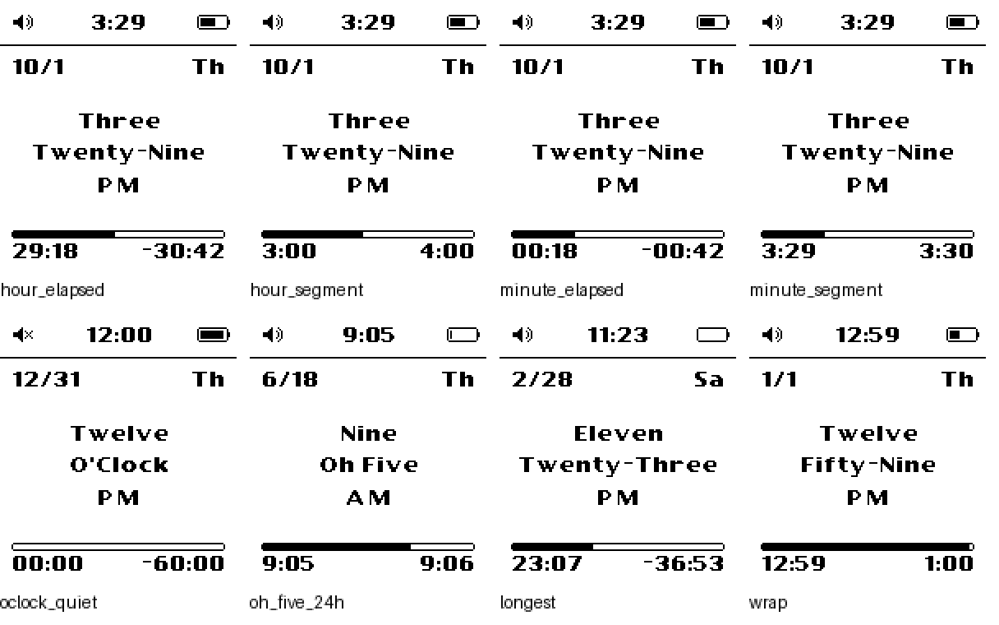
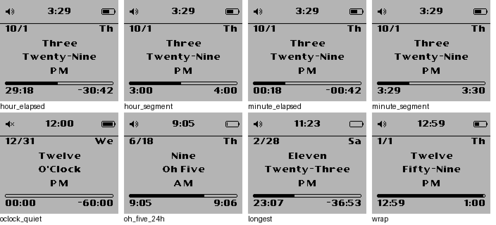
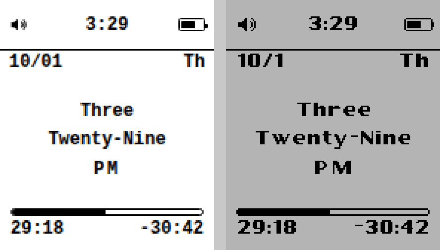
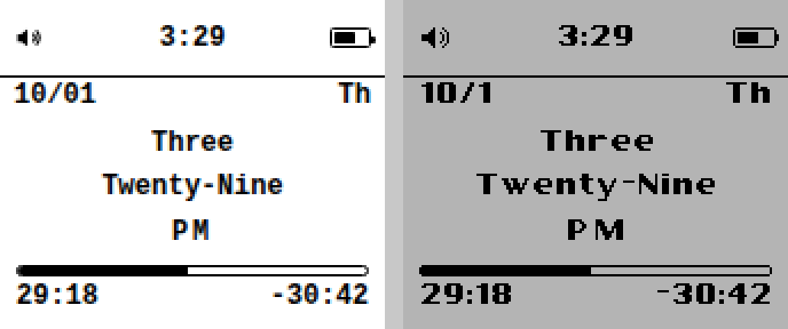

# poddle

The Pebble watch face that brings you back to 2004: a layout in the style of the most popular mp3 player in year 2004
(status bar, info area, progress bar) on a 144×168 B/W screen, in portrait
(default) or landscape.

Targets: **aplite** (Pebble / Pebble Steel), **diorite** (Pebble 2, Pebble 2 SE),
**flint** (Pebble 2 Duo). No color or round platforms, and no emery/gabbro.

## Development environment

### Normal path

```sh
uv tool install pebble-tool --python 3.13
pebble sdk install latest
pebble build
pebble install --emulator flint
```

### From-source path (when sdk.repebble.com is unreachable)

The cloud container used to build this repo blocks `sdk.repebble.com`, so the
SDK was built from PebbleOS source instead. `tools/setup_sdk_from_source.sh`
reproduces it:

1. Installs host packages (`gettext`, `librsvg2-bin`, cmake/ninja, SDL/pixman
   runtime libs for QEMU).
2. Installs `pebble-tool` with uv (Python 3.13).
3. Installs the [PebbleOS-SDK](https://github.com/coredevices/PebbleOS-SDK)
   release bundle (ARM GCC 14.2 + picolibc + `qemu-pebble`) from GitHub.
4. Clones `coredevices/pebbleos` at a pinned tag (`v4.38.4`), applies
   `tools/pebbleos-qemu-null-event.patch`, builds the `qemu_flint` SDK-shell
   firmware and the app SDK for aplite/diorite/flint.
5. Lays it out as a pebble-tool SDK named `source-local` and activates it.
6. On hosts without IPv6, patches pypkjs to bind `0.0.0.0` (it otherwise fails
   with `Address family not supported`).

```sh
WORK=~/pebble-src ./tools/setup_sdk_from_source.sh
pebble build
tools/emu.sh start && tools/emu.sh install && tools/emu.sh shot shot.png
```

Things worth knowing about this path:

- **Frozen platforms.** aplite and diorite are frozen at old SDK revisions;
  upstream ships their `libpebble.a` prebuilt from the legacy SDK. The script
  regenerates it from the frozen export list. It links and the symbol order
  matches, but it is not byte-identical to the official library. **Build
  release `.pbw`s with the official SDK.**
- **Emulator.** Current PebbleOS only has a QEMU board for flint among our
  targets. Flint has the same 144×168 B/W display as diorite and aplite, so
  it is the visual reference for all three.
- **Firmware patch.** The SDK-shell firmware asserts
  (`event_service_client.c:41`) when an installed app launches over the
  built-in TicToc face: the dying app task gets a `PEBBLE_NULL_EVENT`. The
  patch drops null events in the app event loop. It only affects the local
  emulator image.
- **`tools/emu.sh`** runs QEMU headless with pypkjs as the phone. Use it
  instead of `pebble install --emulator`, which reconnects to the
  firmware's serial link, and the firmware stops answering after a
  reconnect.

## The face

Portrait (default) and landscape, switchable in the settings:




Each orientation lays the face out on its own design canvas: 144×168 in
portrait, 168×144 in landscape (rotated 90° clockwise onto the screen). Every
glyph and icon comes from one of four sprite sheets, and each sheet is built
twice: upright for portrait, and pre-rotated for landscape. Only the active
orientation's sheets are loaded. At runtime the face only blits: in
landscape, `canvas_to_screen()` moves a rect's origin onto the screen, and
no pixels are ever rotated.

| Row | Content |
|---|---|
| Status | quiet-time icon · time (follows the 12h/24h setting) · battery |
| Date | `M/D` · two-letter weekday |
| Spoken time | hour word / minute word / AM-PM (always 12-hour) |
| Progress | bar + labels |

Settings (Clay): orientation (portrait/landscape), what the bar measures
(minute/hour), and what the labels show (start-end/elapsed-remaining).

Ticks are per-second when the bar is in minute mode or the labels show
elapsed/remaining, and per-minute otherwise.

### Layout values (for review)

All in canvas pixels. Text y values are cap tops, and text ink keeps an 8px
margin on both sides. W×H is the canvas: 144×168 portrait, 168×144
landscape.

- Status row 0–32: text cap at y=11, centered on W/2; icons at y=12; speaker
  x=8; battery body from W−24 to W−7 (nub 2px past it); separator line at
  y=33.
- Date row: cap at y=36.
- Spoken time, centered on W/2: caps at y=69 / 88 / 108 in portrait,
  57 / 76 / 96 in landscape.
- Progress: track x=7, y=H−28, (W−14)×5 with clipped corners; labels cap at
  y=H−20.

These come from measuring the mockup at 1× (Frames 1–2 for portrait, Frame 3
for landscape). In both orientations every element sits within 1px of the
mockup (`tools/compare_mock.py`).




### Font

[Carthage Sans](https://github.com/csyde/carthage-fonts) Bold by Brian
Connors, used under the SIL Open Font License 1.1 (see `tools/fonts/`). It is
rendered at 16px, where one FontStruct brick is exactly one pixel, which
gives a 9px cap height. The longest line, "Twenty-Three", is 122px wide, so
it and "O'Clock" (61px) fit easily.

## App store listing

The description and screenshots are attached at publish time; the `.pbw`
carries neither.

- `store/description.txt`: the listing description (contact information
  only).
- `store/screenshots/`: one portrait and one landscape 144×168 B/W
  screenshot per platform, regenerated with `tools/store_screenshots.sh`
  (emulator running).
- `tools/publish.sh`: runs `pebble publish --non-interactive` with both,
  portrait first so it leads the listing. The description only applies when
  the store app is first created. To swap the screenshots of an existing app,
  pass `--replace-screenshots`.

## Working on it

```sh
python3 tools/gen_assets.py     # regenerate resources/images/*.png (both orientations) + src/c/assets.h
python3 tests/check_logic.py    # host-side logic tests
pebble build && cp build/poddle.pbw dist/

tools/emu.sh start
# pinned demo build: time date/wday mode format battery quiet 24h orientation
tools/screenshot.sh /tmp/shot 15:29:18 10/1/4 1 1 65 0 0 0
NODE_PATH=$(npm root -g) node tools/render_mock.js 2026-10-01T15:29:18 /tmp/mock
python3 tools/compare_mock.py /tmp/mock_portrait_hour.png /tmp/shot_canvas.png /tmp/cmp
# landscape: pass 1 as the last screenshot.sh argument, compare with /tmp/mock_canvas.png
```

Screenshot builds pin the time, battery and settings through
`PODDLE_DEFINES` (see `wscript` and the `DEMO_*` blocks in `main.c`). A
normal `pebble build` leaves them out.

## Repository layout

- `src/c/` — watch face (`main.c`), canvas blitting, time words, labels
- `src/c/assets.h`, `resources/images/` — generated sprite sheets (committed)
- `src/pkjs/` — Clay config page
- `tools/` — asset pipeline, SDK setup, emulator/screenshot/compare/publish helpers
- `store/` — app store description and screenshots
- `tests/` — logic tests
- `dist/poddle.pbw` — committed build output
- `docs/` — handover spec, HTML mockup, screenshots
